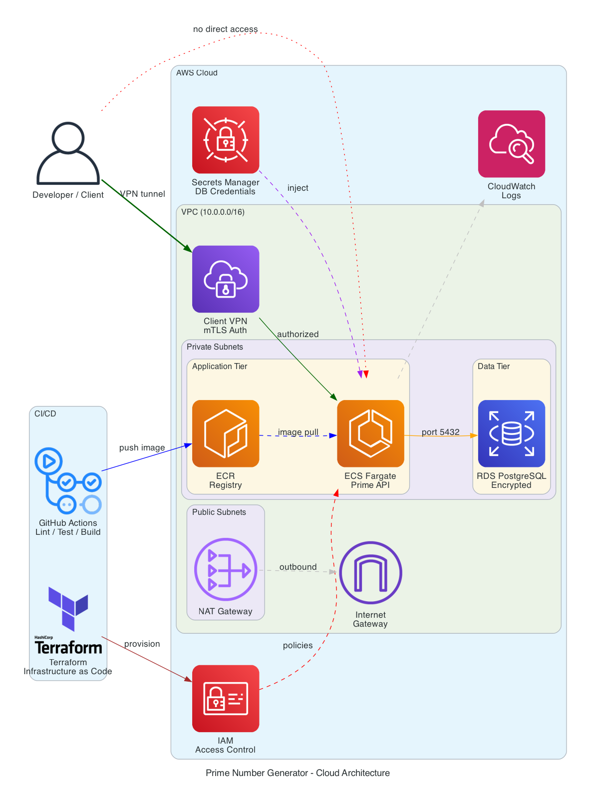
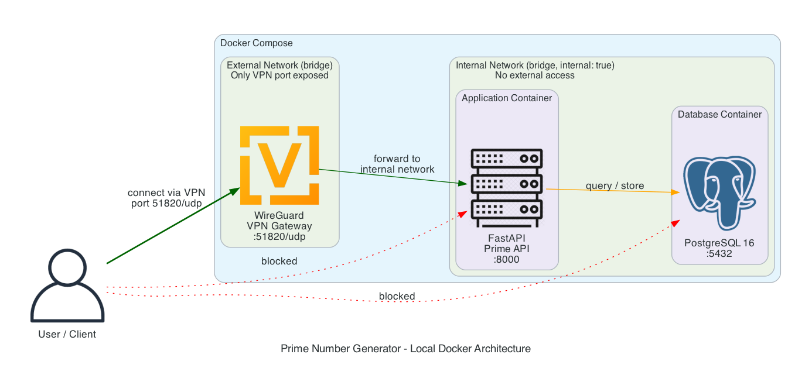

# Prime Number Generator — Microservice

A containerized microservice that generates prime numbers within a given range, stores each execution in PostgreSQL, and is accessible only through a VPN-secured network.

Built with Python (FastAPI), PostgreSQL, Docker Compose, WireGuard VPN, and Terraform (AWS).

---

## Project Structure

```
├── app/                        # Application source code
│   ├── api/routes.py           # HTTP API endpoints
│   ├── core/config.py          # Environment-based configuration
│   ├── core/prime.py           # Sieve of Eratosthenes implementation
│   ├── db/models.py            # SQLAlchemy database model
│   ├── db/session.py           # Database connection management
│   ├── schemas/prime.py        # Pydantic request/response schemas
│   └── main.py                 # FastAPI application entry point
├── tests/                      # Unit and API tests
├── vpn/                        # WireGuard VPN configuration templates
├── deploy/terraform/           # AWS infrastructure as code
├── diagrams/                   # Architecture diagrams
├── .github/workflows/ci.yml    # CI pipeline (lint, test, build)
├── Dockerfile                  # Application container
├── docker-compose.yml          # Local orchestration
├── requirements.txt            # Python dependencies
└── .env.example                # Environment variables template
```

---

## Architecture Overview

### AWS Cloud Architecture



### Local Docker Architecture



**Key security principles:**
- All services run on an internal Docker network with no external access
- The API is reachable only through the WireGuard VPN gateway
- The database accepts connections only from the application container
- All credentials are managed via environment variables, never hardcoded
- RDS storage is encrypted at rest (AWS deployment)
- AWS Secrets Manager stores database credentials in production

---

## API Endpoints

| Method | Endpoint | Description |
|--------|----------|-------------|
| `GET` | `/api/v1/health` | Health check |
| `POST` | `/api/v1/primes` | Generate primes for a range `{"start": 1, "end": 100}` |
| `GET` | `/api/v1/primes/history` | List past queries (paginated, `?limit=20`) |
| `GET` | `/api/v1/primes/{id}` | Retrieve a specific query result |

---

## Local Quick Start

### Prerequisites

- Docker and Docker Compose installed
- WireGuard tools (`brew install wireguard-tools` on macOS)

### Step 1: Configure Environment

```bash
cp .env.example .env
```

Edit `.env` with your database credentials:
```
DATABASE_URL=postgresql://<DB_USER>:<DB_PASSWORD>@db:5432/<DB_NAME>
POSTGRES_USER=<DB_USER>
POSTGRES_PASSWORD=<DB_PASSWORD>
POSTGRES_DB=<DB_NAME>
```

### Step 2: Configure WireGuard VPN

Generate key pairs:
```bash
wg genkey | tee /tmp/server_private.key | wg pubkey > /tmp/server_public.key
wg genkey | tee /tmp/client_private.key | wg pubkey > /tmp/client_public.key
```

Copy and fill in the config templates:
```bash
cp vpn/wg0.conf.example vpn/wg0.conf
cp vpn/client.conf.example vpn/client.conf
```

Edit `vpn/wg0.conf`:
- Replace `<SERVER_PRIVATE_KEY>` with contents of `/tmp/server_private.key`
- Replace `<CLIENT_PUBLIC_KEY>` with contents of `/tmp/client_public.key`

Edit `vpn/client.conf`:
- Replace `<CLIENT_PRIVATE_KEY>` with contents of `/tmp/client_private.key`
- Replace `<SERVER_PUBLIC_KEY>` with contents of `/tmp/server_public.key`
- Replace `<SERVER_IP>` with `localhost`

Clean up temporary keys:
```bash
rm /tmp/server_private.key /tmp/server_public.key /tmp/client_private.key /tmp/client_public.key
```

### Step 3: Build and Run

```bash
docker-compose up --build -d
```

Verify all containers are running:
```bash
docker-compose ps
```

Expected output:
```
NAME          IMAGE                          SERVICE   STATUS
prime-api     casestudy-app                  app       Up
prime-db      postgres:16-alpine             db        Up (healthy)
vpn-gateway   linuxserver/wireguard:latest   vpn       Up
```

### Step 4: Test the API

All requests must go through the VPN container since the API is not exposed externally:

```bash
# Health check
docker exec vpn-gateway curl -s http://prime-api:8000/api/v1/health

# Generate primes in range 1-100
docker exec vpn-gateway curl -s -X POST http://prime-api:8000/api/v1/primes -H "Content-Type: application/json" -d '{"start": 1, "end": 100}'

# View query history
docker exec vpn-gateway curl -s http://prime-api:8000/api/v1/primes/history
```

Verify VPN isolation — this should fail:
```bash
curl http://localhost:8000/api/v1/health
# Expected: "Failed to connect to localhost port 8000"
```

### Step 5: Run Tests

```bash
pip install -r requirements.txt
pytest tests/ -v
```

---

## AWS Cloud Deployment

### Prerequisites

- AWS CLI installed and configured (`aws configure`)
- Terraform >= 1.5.0
- Docker installed
- AWS account with permissions for: VPC, ECS, ECR, RDS, Client VPN, IAM, CloudWatch, Secrets Manager

### Step 1: Configure Variables

```bash
cd deploy/terraform
cp terraform.tfvars.example terraform.tfvars
```

Edit `terraform.tfvars` with your values:
```hcl
aws_region                 = "eu-central-1"
project_name               = "prime-api"
db_username                = "your_db_user"
db_password                = "your_secure_password"
db_name                    = "your_db_name"
vpn_server_certificate_arn = "<ACM_SERVER_CERT_ARN>"
vpn_client_certificate_arn = "<ACM_CLIENT_CERT_ARN>"
```

> **Important:** Never commit `terraform.tfvars` — it contains sensitive values.

### Step 2: Generate VPN Certificates

AWS Client VPN uses mutual TLS authentication:

```bash
git clone https://github.com/OpenVPN/easy-rsa.git /tmp/easy-rsa
cd /tmp/easy-rsa/easyrsa3

./easyrsa init-pki
./easyrsa build-ca nopass
./easyrsa build-server-full server nopass
./easyrsa build-client-full client1 nopass
```

Upload to AWS ACM:

```bash
aws acm import-certificate \
  --certificate fileb://pki/issued/server.crt \
  --private-key fileb://pki/private/server.key \
  --certificate-chain fileb://pki/ca.crt \
  --region eu-central-1

aws acm import-certificate \
  --certificate fileb://pki/issued/client1.crt \
  --private-key fileb://pki/private/client1.key \
  --certificate-chain fileb://pki/ca.crt \
  --region eu-central-1
```

Use the returned ARN values in `terraform.tfvars`.

### Step 3: Deploy Infrastructure

```bash
cd deploy/terraform

terraform init
terraform plan -out=tfplan
terraform apply tfplan
```

Save the outputs:
```bash
terraform output
```

### Step 4: Build and Push Docker Image

```bash
aws ecr get-login-password --region eu-central-1 | \
  docker login --username AWS --password-stdin <ACCOUNT_ID>.dkr.ecr.eu-central-1.amazonaws.com

docker build -t prime-api .
docker tag prime-api:latest <ECR_REPOSITORY_URL>:latest
docker push <ECR_REPOSITORY_URL>:latest
```

Replace `<ECR_REPOSITORY_URL>` with the value from `terraform output ecr_repository_url`.

### Step 5: Deploy ECS Service

```bash
aws ecs update-service \
  --cluster prime-api-cluster \
  --service prime-api-service \
  --force-new-deployment \
  --region eu-central-1
```

Verify:
```bash
aws ecs describe-services \
  --cluster prime-api-cluster \
  --services prime-api-service \
  --region eu-central-1 \
  --query 'services[0].{status:status,running:runningCount,desired:desiredCount}'
```

### Step 6: Connect via VPN

```bash
aws ec2 export-client-vpn-client-configuration \
  --client-vpn-endpoint-id <VPN_ENDPOINT_ID> \
  --output text > vpn-client-config.ovpn

echo "<cert>" >> vpn-client-config.ovpn
cat /tmp/easy-rsa/easyrsa3/pki/issued/client1.crt >> vpn-client-config.ovpn
echo "</cert>" >> vpn-client-config.ovpn
echo "<key>" >> vpn-client-config.ovpn
cat /tmp/easy-rsa/easyrsa3/pki/private/client1.key >> vpn-client-config.ovpn
echo "</key>" >> vpn-client-config.ovpn

sudo openvpn --config vpn-client-config.ovpn
```

### Step 7: Test the API

```bash
curl http://<ECS_PRIVATE_IP>:8000/api/v1/health

curl -X POST http://<ECS_PRIVATE_IP>:8000/api/v1/primes \
  -H "Content-Type: application/json" \
  -d '{"start": 1, "end": 100}'

curl http://<ECS_PRIVATE_IP>:8000/api/v1/primes/history
```

---

## IAM Access Control

| Role | Purpose | Permissions |
|------|---------|-------------|
| ECS Task Execution Role | Pull images, read secrets, write logs | `AmazonECSTaskExecutionRolePolicy` + Secrets Manager access |
| Developer | Deploy updates, view logs | `ecr:PushImage`, `ecs:UpdateService`, `logs:GetLogEvents` |
| Admin | Full infrastructure management | Full access to VPC, ECS, RDS, VPN, IAM |
| Read-Only | View resources and logs | `ecs:Describe*`, `rds:Describe*`, `logs:Get*` |

### Creating a Developer User

```bash
aws iam create-group --group-name prime-api-developers

aws iam put-group-policy \
  --group-name prime-api-developers \
  --policy-name deploy-policy \
  --policy-document '{
    "Version": "2012-10-17",
    "Statement": [
      {
        "Effect": "Allow",
        "Action": [
          "ecr:GetAuthorizationToken",
          "ecr:BatchCheckLayerAvailability",
          "ecr:PutImage",
          "ecr:InitiateLayerUpload",
          "ecr:UploadLayerPart",
          "ecr:CompleteLayerUpload",
          "ecs:UpdateService",
          "ecs:DescribeServices",
          "logs:GetLogEvents",
          "logs:DescribeLogStreams"
        ],
        "Resource": "*"
      }
    ]
  }'

aws iam add-user-to-group \
  --group-name prime-api-developers \
  --user-name <USERNAME>
```

---

## CI/CD Pipeline

The project includes a GitHub Actions pipeline (`.github/workflows/ci.yml`) that runs on every push and pull request:

1. **Lint** — flake8 code style checks
2. **Test** — pytest with 16 unit and API tests
3. **Build** — Docker image build verification

---

## Cleanup

To destroy all AWS resources:

```bash
cd deploy/terraform
terraform destroy
```

> **Warning:** This will delete the RDS database and all data. Create a snapshot first if needed.
